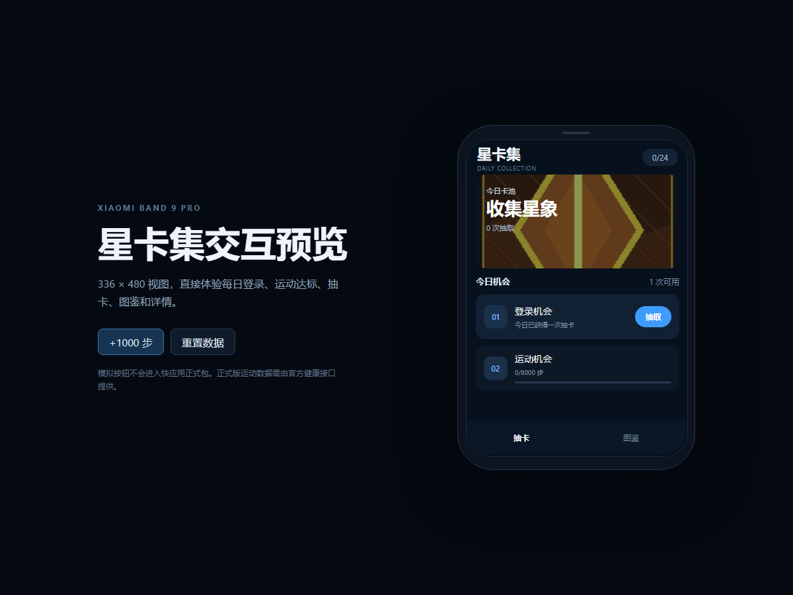

# 小米手环 9 Pro 集卡快应用

面向小米手环 9 Pro 的集卡快应用（Xiaomi Vela JS 手表快应用）。



## 项目概览

| 项目 | 内容 |
| --- | --- |
| 项目名称 | 星卡集 |
| 目标设备 | 小米手环 9 Pro |
| 应用类型 | Xiaomi Vela JS 手表快应用 |
| 当前版本 | `0.1.0` |
| 包名 | `com.lovepower.starcard` |

主要功能：

- 每日首次打开应用获得一次抽卡机会。
- 每日累计步数达到 8000 步获得一次抽卡机会。
- 抽卡后可以查看结果。
- 图鉴支持查看 24 张卡片的收集状态。
- 卡片分为普通、稀有、史诗、传说四个等级。
- 重复卡会累计持有数量。
- 所有数据保存在本地，不接入服务端。

## 交互预览

浏览器交互预览地址：

```text
http://127.0.0.1:4173/simulator/
```

本地启动预览服务：

```powershell
npm run preview
```

页面模拟 336 × 480 视图，可体验每日登录、运动达标、抽卡、图鉴和详情。
预览页上的模拟按钮不会进入快应用正式包，正式版运动数据由官方健康接口提供。

## 直接安装（调试版 RPK）

```text
release/com.lovepower.starcard.debug.0.1.0.rpk
```

- 文件大小：95038 字节，约 92.8 KB
- SHA256：`DA8357B93A54E4B3B2F8A466FB5F8CC049EA049C6C878C0A10AF41C62917F2C0`
- 构建模式：debug
- 目标设备类型：watch

### AstroBox 安装步骤

1. 在电脑或手机打开 AstroBox。
2. 连接小米手环 9 Pro。
3. 进入已连接设备的资源安装页面。
4. 选择本地安装或本地资源。
5. 选择 `release/com.lovepower.starcard.debug.0.1.0.rpk`。
6. 等待传输并安装完成。
7. 首次打开时如果出现健康数据授权，请允许读取当天步数。

## 工程结构

```text
app/                 与平台无关的原型、核心逻辑和卡面资源
  assets/cards/      24 张卡片图片
  core/              状态、存储和游戏规则
  data/              卡片及稀有度配置
  pages/             首页、图鉴、详情
docs/                产品设计、体积预算和 SDK 说明
release/             可安装的 RPK
simulator/           浏览器交互预览
tests/               核心逻辑和体积测试
tools/               卡面生成、体积检查和预览服务器
vela/                AIoT-IDE 可构建的 Vela 手表工程
  src/
    common/cards/    24 张本地卡面
    core/            状态、存储和游戏规则
    data/            卡片和稀有度配置
    pages/           首页、图鉴、详情
  build/             编译后的应用资源
  dist/              编译生成的 RPK
```

完整的交接说明见 [`docs/project-handoff.md`](docs/project-handoff.md)。

## 玩法和概率

### 每日机会

登录机会：

- 每天首次打开应用时获得。
- 机会不跨天累积。
- 同一天重复打开不会重复发放。

运动机会：

- 默认目标为 8000 步。
- 使用 `@service.health.getTodaySteps()` 读取当天累计步数。
- 达到目标后发放一次运动抽卡机会。
- 请求失败、用户拒绝授权或设备不支持时，不影响其他页面功能。

### 稀有度和概率

| 等级 | 名称 | 总概率 | 卡片数量 | 单张概率 |
| --- | --- | ---: | ---: | ---: |
| N | 普通 | 60% | 12 | 5% |
| R | 稀有 | 30% | 7 | 约 4.2857% |
| SR | 史诗 | 9% | 4 | 2.25% |
| SSR | 传说 | 1% | 1 | 1% |

当前没有保底机制。

## 页面说明

### 首页

- 显示收藏进度和累计抽卡次数。
- 显示登录机会和运动机会。
- 运动未达标时显示当前步数、目标步数和进度条。
- 点击抽取后显示卡片、等级、说明和是否为新卡。
- 底部可以进入图鉴。

### 图鉴

- 三列卡片布局。
- 未获得的卡片显示为锁定状态。
- 重复卡显示持有数量。
- 已获得卡片可以进入详情。

### 详情

- 展示卡面、名称、等级、说明和持有数量。
- 不提供出售、融合或交易功能。

## 技术说明

### 构建环境

- AIoT-IDE：1.7.0
- aiot-toolkit：2.0.5
- Node.js：v24.19.0
- 构建系统：Windows x64
- 工程配置：`deviceTypeList: ["watch"]`
- 设计宽度：`device-width`

### 使用接口

- `@service.health`：读取当天步数。
- `@system.storage`：保存卡册和每日机会状态。
- `@system.router`：首页、图鉴和详情页切换。

### 本地状态

状态内容主要包括当前日期、登录机会是否领取、运动机会是否领取、当天步数、
每张卡的持有数量、累计抽卡次数。序列化后的状态很小，不涉及数据库和网络请求。

## 运行与校验

```powershell
npm test
npm run check:budget
npm run verify
```

重新生成占位卡面：

```powershell
npm run assets:generate
```

## 重新构建 RPK

`vela/` 是 AIoT-IDE 1.7 / aiot-toolkit 2.0.5 可构建的手表工程。

```powershell
cd vela
npm install
npm run build
```

构建产物位于 `vela/dist/`：

```text
com.lovepower.starcard.debug.0.1.0.rpk
```

## 当前验证结果

- 核心逻辑测试：10 项全部通过。
- 单张卡面限制：全部低于 50 KB。
- 最大卡面：约 2.37 KB。
- 整包 RPK：约 92.8 KB，低于 1 MB。
- AIoT 编译：成功，没有编译警告。

## 风险说明

当前应用没有死循环、常驻后台任务、联网请求、持续定时器、跨端通信和复杂动画
循环，因此导致手环整机死机的风险较低。

可能出现的问题：

- 设备固件不支持步数接口。
- 用户拒绝健康数据授权。
- 调试 RPK 与设备版本不完全兼容。
- AstroBox 安装时返回签名或版本错误。
- 第三方运行环境自身的兼容性问题。

如果应用卡住，应返回表盘或重启手环，然后通过 AstroBox 卸载应用。应用不会在
开机时自动运行，也不会常驻后台。

## 平台适配说明

`app/` 已按常见快应用 `.ux` 结构组织，但不同 Vela/穿戴快应用 SDK 版本的
`manifest.json`、路由、存储接口和健康数据接口可能存在差异。接入官方 SDK
后，应优先核对 `docs/quickapp-sdk-checklist.md` 中的项目，再调整页面导入、
资源路径和运动数据适配层。

本项目明确采用本地模式，不接入服务端。用户修改系统时间、重装应用或篡改
本地存储后，可以绕过每日次数限制；这是当前为爱发电版本的刻意取舍，不作为
安全问题处理。

## 后续可做事项

- 在小米手环 9 Pro 真机上验证健康授权和步数读取。
- 检查 336 x 480 屏幕的圆角和底部安全区。
- 根据真机效果调整字体和间距。
- 替换正式卡面资源。
- 增加保底、卡片详情动画或抽卡动画。
- 增加更多卡片和收藏分类。
